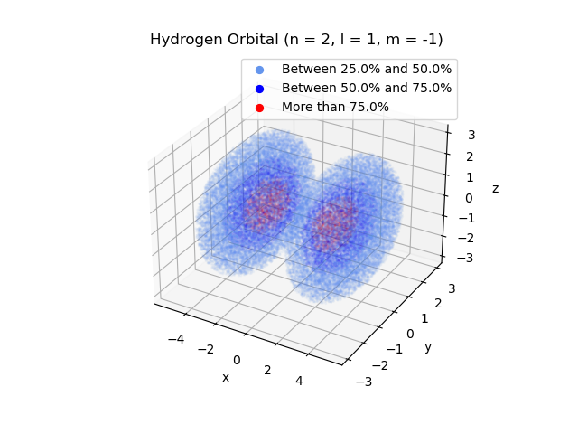
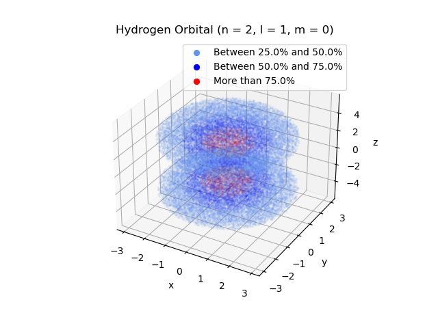
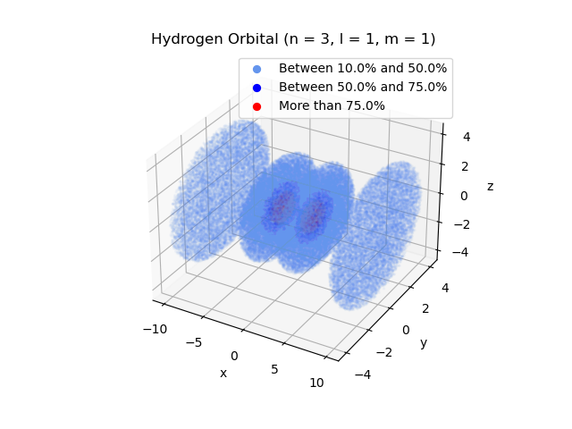
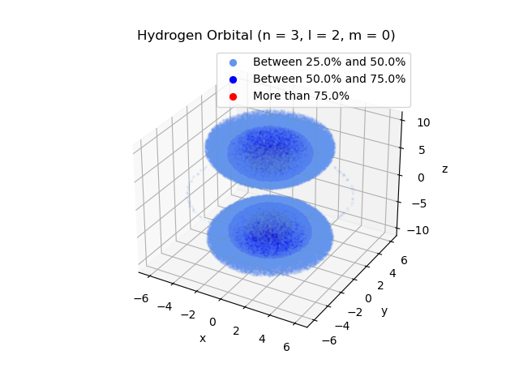

# Atomic Orbitals of Hydrogen
The hydrogen wave function can be written as,

&space;=&space;Y_{l,m}(\theta,\phi)e^{-r/na_{1}}(\frac{r}{a_{1}})^{l}L_{n-l-1}(r))
- ), spherical harmonic,
- ), a Laguerre polynomial.

The aim of the program is to simulate the possible electrons' position of the hydrogen atom in different states. The main steps of the program for each states are :
1. A 3D arbitrary grid is created.
2. The hydrogen wavefunction is calculated for each portion of space. The positive part is separated from the negative one, and their probability are determined separetly.
3. The electrons' coordinates are generated randomly following these two different probability law. The one following the negative law will have its electrons "return" in the space i.e. every coordinates will change sign, in order to reproduce the "negativity" of there wavefunction.
4. Then, depending on each state, the electron's coordinates will be plot with a color code revealing the most likely electron's positions.

Thanks to this approach, we can observe that the electrons will form atomic orbitals that we can compare to the litterature.

## Structure of the project
These are the steps needed in order to start the program and to plot the results:
1. First, the user has to choose the initial 3D grid geometry, the number of coordinate, the specific orbital of the hydrogen and the probabilities of presence we want to put forward.  This can be done in the [configuration](https://github.com/Laurecaz/Software-and-Computing-for-Applied-Physics/blob/102bd30c6aaa54a23c2e705d57a4043867b9b39f/configuration.txt) file. There are physical selection rule for the numbers n, l and m that the user should respected in order to avoid an error message. The initial 3D grid must be defined in order to have enough data with a small time of calculation. The values ,  and  permit a good equilibrium.  The number of coordinates must be chosen with attention for the same reasons. As default, it is settle as , it must be much larger for the level l = 0, m = 0. Notice that the choice of probabilities of presence will influence the shape of the orbital, and this is why it must be choose carefully.
2. Then, the user have to launched the [simulation](https://github.com/Laurecaz/Software-and-Computing-for-Applied-Physics/blob/210eff060e604a76519aac8830f16862f5375748/simulation.py) file, which imports the selected parameters of the [configuration](https://github.com/Laurecaz/Software-and-Computing-for-Applied-Physics/blob/102bd30c6aaa54a23c2e705d57a4043867b9b39f/configuration.txt) file thanks to the ConfigParser library. It constructs the probability laws that the electron follow in agreement to the orbital selected earlier.
3. At the end, the probability laws are used to create the coordinates. The user has to launch the [plots](https://github.com/Laurecaz/Software-and-Computing-for-Applied-Physics/blob/210eff060e604a76519aac8830f16862f5375748/plots.py) file which permit to visualize the electrons' position in 3D. The plot are loaded through their local paths thanks to the [configuration](https://github.com/Laurecaz/Software-and-Computing-for-Applied-Physics/blob/102bd30c6aaa54a23c2e705d57a4043867b9b39f/configuration.txt) file and then they are saved in the images folder automatically.

This project is divided into five blocks :
- In the file [functions](https://github.com/Laurecaz/Software-and-Computing-for-Applied-Physics/blob/210eff060e604a76519aac8830f16862f5375748/functions.py) all our functions are stocked. They are tools used for the construction of our data.
- In the file [TEST](https://github.com/Laurecaz/Software-and-Computing-for-Applied-Physics/blob/210eff060e604a76519aac8830f16862f5375748/TEST.py), the functions are tested, to ensure as much as possible that the program is working properly.
- In the file [configuration](https://github.com/Laurecaz/Software-and-Computing-for-Applied-Physics/blob/102bd30c6aaa54a23c2e705d57a4043867b9b39f/configuration.txt) there are the definitions of the parameters used in the simulation and the plot file : the initial 3D grid, the specific orbital (n,l,m, the number of coordinates we want to simulate and the range of probabilities we want to see. There is also the local paths in order to load and to save the plots in a folder named "Images". 
- In the file [simulation](https://github.com/Laurecaz/Software-and-Computing-for-Applied-Physics/blob/210eff060e604a76519aac8830f16862f5375748/simulation.py) there is the main part of the code. It will calculate the wave-function of each point in the 3D grid for the specific orbital. Then the "positive" and "negative" wave-function are used to calculate their probabilities separatly.
- In the file [plots](https://github.com/Laurecaz/Software-and-Computing-for-Applied-Physics/blob/210eff060e604a76519aac8830f16862f5375748/plots.py) the coordinates are calculated thanks to the probability law calculated in the [simulation](https://github.com/Laurecaz/Software-and-Computing-for-Applied-Physics/blob/210eff060e604a76519aac8830f16862f5375748/simulation.py) file and then they are plotted in 3 dimensions using matplotlib.pyplot, with a color code according to the chosen probabilities of presence.

Here, some results of this program :

